# 🚀 SpaceEx - Exoplanet Detection Platform

<div align="center">

**Advanced Machine Learning Platform for Astronomical Discovery**

[](https://reactjs.org)
[](https://fastapi.tiangolo.com)
[](https://python.org)
[](https://scikit-learn.org)

*Unveiling the secrets of distant worlds through cutting-edge AI*

[🚀 Live Demo](#) • [📚 Documentation](#) • [🐛 Report Bug](https://github.com/koffandaff/spaceex/issues) • [💡 Request Feature](https://github.com/koffandaff/spaceex/issues)

</div>

## 📖 Table of Contents
- [🌌 Project Overview](#-project-overview)
- [🛠 Tech Stack](#-tech-stack)
- [🚀 Features](#-features)
- [🏗️ System Architecture](#️-system-architecture)
- [📊 Machine Learning Pipeline](#-machine-learning-pipeline)
- [🔌 API Documentation](#-api-documentation)
- [🛠️ Installation & Setup](#️-installation--setup)
- [🎯 Usage Guide](#-usage-guide)
- [👥 Development Team](#-development-team)
- [🤝 Contributing](#-contributing)
- [🔮 Future Scope](#-future-scope)
- [📄 License](#-license)

---

## 🌌 Project Overview

SpaceEx is a sophisticated web application that leverages advanced machine learning algorithms to detect exoplanets from astronomical data. By analyzing light curve data from telescopes like Kepler and TESS, SpaceEx provides astronomers and researchers with a powerful tool for identifying potential exoplanets with unprecedented accuracy.

### 🎯 Project Vision
To democratize exoplanet discovery by providing an accessible, accurate, and scalable platform that combines state-of-the-art machine learning with intuitive visualization tools.

### 🔬 Scientific Significance
- **Automated Detection**: Reduces manual analysis time from weeks to minutes
- **Multi-Model Consensus**: Combines predictions from 4 different ML algorithms
- **Confidence Scoring**: Provides probabilistic assessments of discoveries
- **Visual Analytics**: Interactive visualizations for result interpretation

---

## 🛠 Tech Stack

### Frontend Layer
- **React 18** - Modern component-based UI framework
- **React Router DOM** - Client-side routing and navigation
- **CSS3** - Cyberpunk space-themed styling with animations
- **Context API** - State management for authentication and user data

### Backend Layer
- **FastAPI** - High-performance Python web framework
- **Python 3.9+** - Core programming language
- **Uvicorn** - ASGI server for production deployment
- **Pydantic** - Data validation and settings management

### Machine Learning
- **XGBoost** - Optimized gradient boosting framework
- **CatBoost** - Handling categorical features effectively
- **LightGBM** - Fast gradient boosting for large datasets
- **Scikit-learn** - Ensemble methods and preprocessing
- **Matplotlib** - Scientific visualization and plotting

### Data & Storage
- **Pandas** - Data manipulation and analysis
- **NumPy** - Numerical computing and array operations
- **Joblib** - Model serialization and persistence

### Development & Deployment
- **Vite** - Frontend build tool and development server
- **npm** - JavaScript package management
- **pip** - Python dependency management
- **Git** - Version control and collaboration

---

## 🚀 Features

### 🌟 Core Capabilities
- **🤖 Multi-Model Ensemble** - XGBoost, CatBoost, LightGBM, and Voting Ensemble working in concert
- **📁 Multi-File Batch Processing** - Simultaneous analysis of multiple astronomical datasets
- **⚖️ Head-to-Head Comparison** - Side-by-side evaluation of different models and datasets
- **📊 Advanced Visualizations** - Interactive charts, probability distributions, and simulated light curves
- **🎯 Role-Based Access Control** - Tailored experiences for Admins, Scientists, and Users
- **🔐 Secure Authentication** - Robust user management with admin approval workflows

### 🎨 User Experience
- **Intuitive Cyberpunk Interface** - Space-themed design with smooth animations and visual feedback
- **Real-time File Validation** - Instant CSV structure verification and data preview
- **Inline Detailed Analysis** - Expandable results without disruptive modal popups
- **Professional Export Capabilities** - Structured data output for further scientific analysis
- **Fully Responsive Design** - Seamless experience across desktop and mobile devices

### 🔧 Technical Excellence
- **RESTful API Architecture** - Well-documented FastAPI endpoints for easy integration
- **Real-time Processing** - Efficient handling of large astronomical datasets
- **Model Version Management** - Flexible system for updates and improvements
- **Scalable Infrastructure** - Architecture designed for high-volume processing demands

---

## 🏗️ System Architecture

### Complete Application Architecture

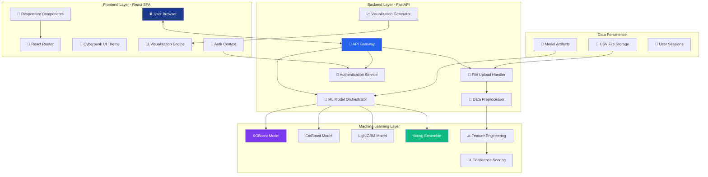

### Authentication & Authorization Flow

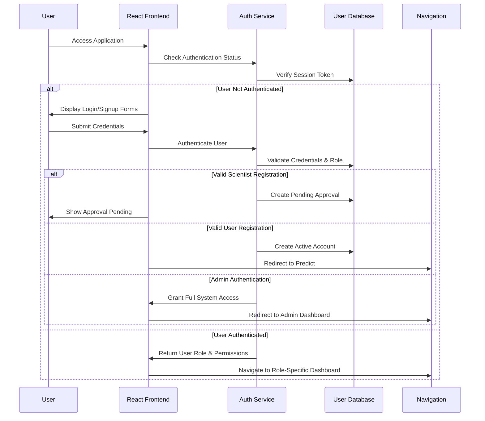

### Multi-File Batch Processing Workflow

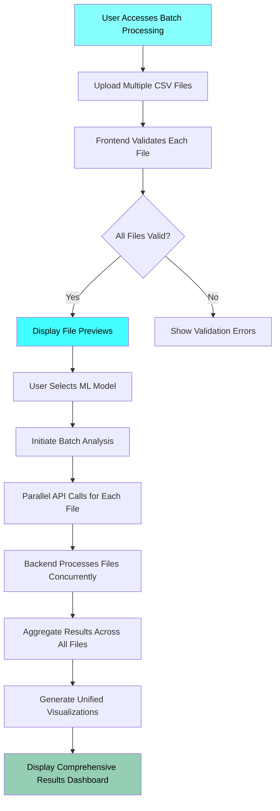

---

## 📊 Machine Learning Pipeline

### Complete ML Training & Inference Pipeline

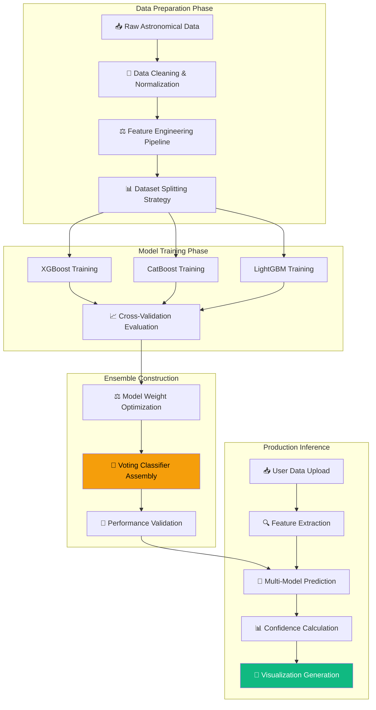

### Real-time Prediction Workflow

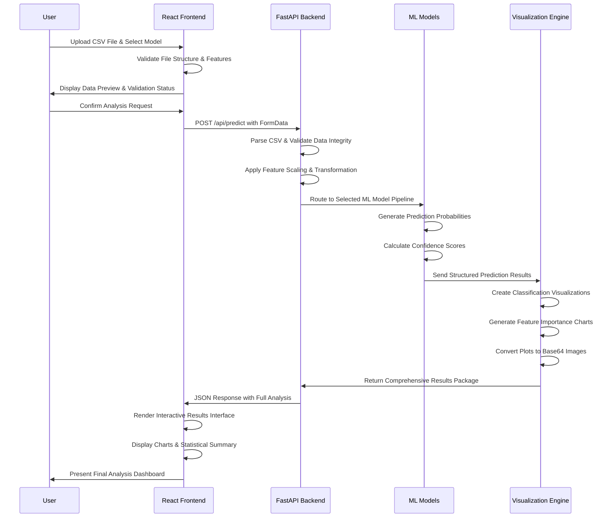

### Model Performance Characteristics

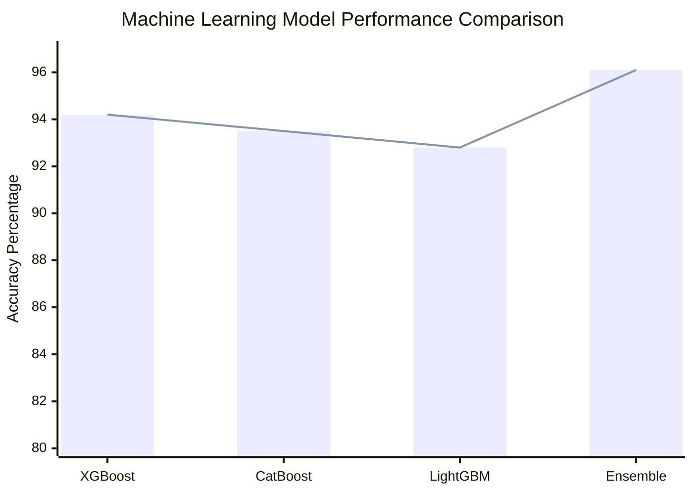

### Feature Importance Analysis

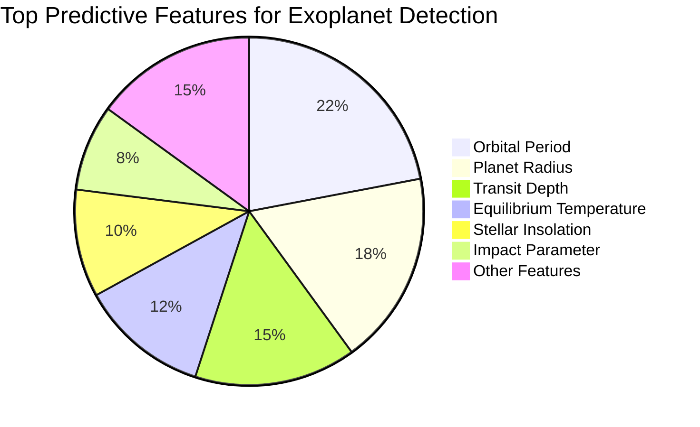

---

## 🔌 API Documentation

### API Architecture Overview

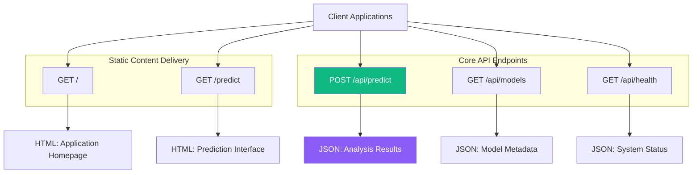

### Request-Response Flow

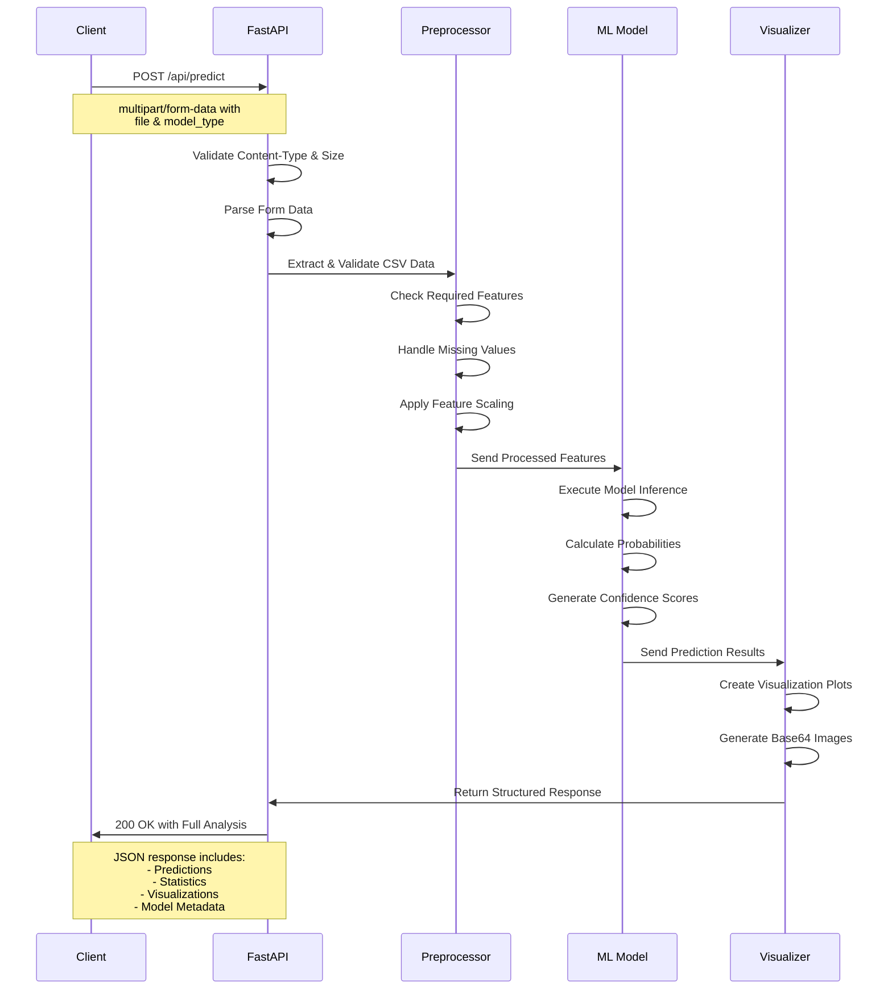

### Core API Endpoints Specification

#### 🎯 Prediction Endpoint
- **Endpoint**: `POST /api/predict`
- **Purpose**: Process astronomical data and generate exoplanet predictions
- **Content-Type**: `multipart/form-data`
- **Parameters**:
  - `file`: CSV file containing astronomical features
  - `model_type`: ML model selection (`xgboost`, `catboost`, `lightgbm`, `ensemble`)

**Response Structure:**
```json
{
  "model_used": "xgboost",
  "file_info": {
    "filename": "kepler_data.csv",
    "rows_processed": 150,
    "features_used": 15
  },
  "predictions": [
    {
      "row": 1,
      "prediction": "🌍 CONFIRMED",
      "confidence": 0.894,
      "probabilities": {
        "false_positive": 0.043,
        "candidate": 0.063,
        "confirmed": 0.894
      }
    }
  ],
  "statistics": {
    "total_predictions": 150,
    "confirmed_count": 45,
    "confirmed_percentage": 30.0,
    "candidate_count": 60,
    "candidate_percentage": 40.0,
    "false_positive_count": 45,
    "false_positive_percentage": 30.0
  },
  "visualizations": {
    "prediction_plot": "data:image/png;base64,...",
    "feature_importance": "data:image/png;base64,..."
  }
}
```

#### ℹ️ System Information Endpoints
- **Model Information**: `GET /api/models` - Returns loaded model status and metadata
- **Health Check**: `GET /api/health` - Provides system status and component health
- **Service Discovery**: `GET /` - Main application entry point with documentation links

### Error Handling
The API provides comprehensive error responses for various scenarios:
- **400 Bad Request**: Invalid file format or missing required parameters
- **413 Payload Too Large**: File exceeds maximum allowed size
- **422 Unprocessable Entity**: Data validation failures
- **500 Internal Server Error**: ML model or processing failures

---

## 🛠️ Installation & Setup

### System Requirements
- **Python 3.9+** for backend services and ML operations
- **Node.js 16+** for frontend development and build processes
- **4GB RAM** minimum for efficient model inference
- **2GB disk space** for ML models and dependencies

### Backend Setup Procedure

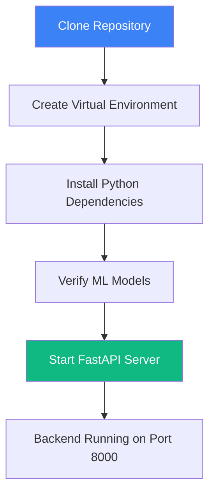

**Step-by-step commands:**
```bash
# Clone the repository
git clone https://github.com/koffandaff/spaceex.git
cd spaceex/backend

# Create and activate virtual environment
python -m venv venv
source venv/bin/activate  # Windows: venv\Scripts\activate

# Install required packages
pip install -r requirements.txt

# Verify model files are present
ls ml_models/

# Start the backend server
python app.py
```

### Frontend Setup Procedure

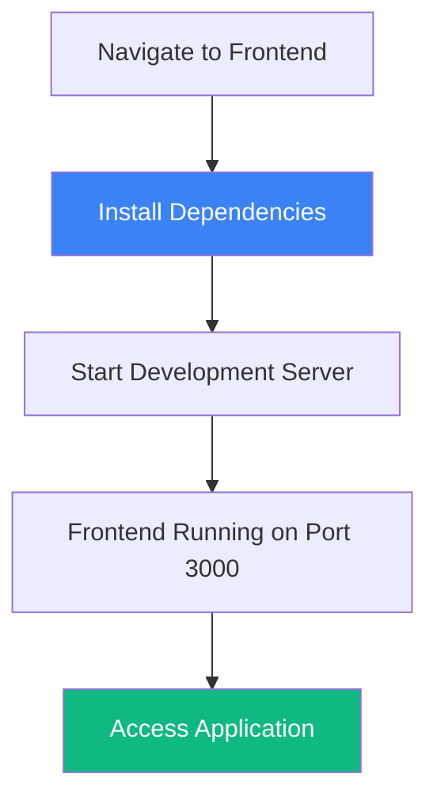

**Step-by-step commands:**
```bash
# Navigate to frontend directory
cd ../frontend

# Install Node.js dependencies
npm install

# Start development server
npm run dev

# Application accessible at http://localhost:3000
```

### Project Structure Overview

```
spaceex/
├── 📁 backend/                         # FastAPI ML Backend
│   ├── 📁 ml_models/                  # Trained ML Models
│   │   ├── XGBoost_pipeline.pkl
│   │   ├── CatBoost_pipeline.pkl
│   │   ├── LightGBM_pipeline.pkl
│   │   ├── VotingEnsemble_pipeline.pkl
│   │   └── preprocessing_artifacts/
│   ├── 📁 static/                     # Frontend Assets
│   ├── 📁 templates/                  # HTML Templates
│   ├── 📁 data/                       # Sample Datasets
│   ├── app.py                         # FastAPI Application
│   ├── train_models.py                # Model Training Script
│   └── requirements.txt               # Python Dependencies
│
└── 📁 frontend/                       # React Application
    ├── public/
    │   └── img.jpg                    # Background Image
    └── src/
        ├── 📁 components/             # React Components
        ├── 📁 context/                # State Management
        ├── 📁 pages/                  # Application Pages
        ├── 📁 services/               # API Integration
        ├── 📁 styles/                 # Styling
        ├── 📁 utils/                  # Utilities
        ├── App.jsx                    # Main Router
        └── main.jsx                   # Application Entry
```

---

## 🎯 Usage Guide

### Complete User Journey

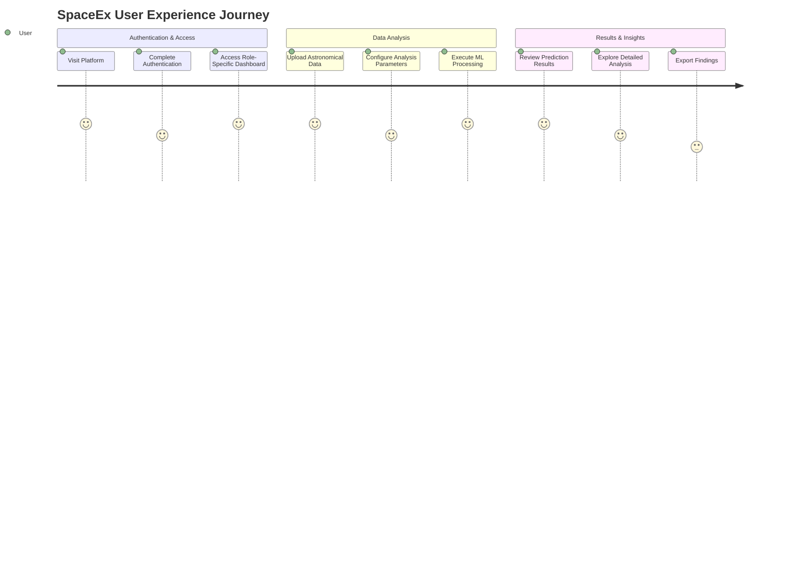

### Analysis Workflow

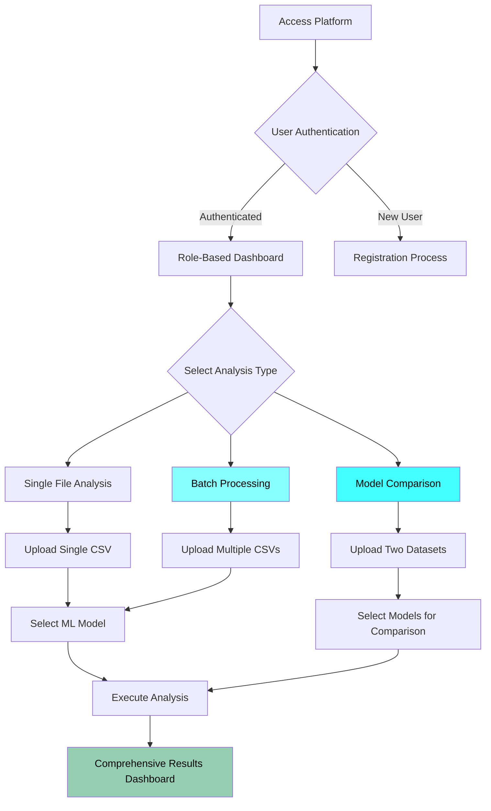

### Input Data Requirements

**Required CSV Features:**
- `period` - Orbital period in days
- `planet_radius` - Planetary radius in Earth radii
- `depth` - Transit depth in parts per million
- `equilibrium_temp` - Planetary equilibrium temperature
- `insolation` - Stellar insolation flux
- `impact` - Impact parameter
- `duration` - Transit duration in hours
- `star_radius` - Stellar radius in Solar radii
- `star_mass` - Stellar mass in Solar masses
- `star_teff` - Stellar effective temperature
- `kepmag` - Kepler magnitude
- `planet_density_ratio` - Planetary density ratio
- `log_period` - Logarithm of orbital period
- `stellar_flux` - Stellar flux measurement
- `temp_ratio` - Temperature ratio

**Example Data Format:**
```csv
period,planet_radius,depth,equilibrium_temp,insolation,impact,duration,star_radius,star_mass,star_teff,kepmag,planet_density_ratio,log_period,stellar_flux,temp_ratio
14.5,2.3,0.005,1250,45.2,0.7,3.2,1.1,1.05,5800,12.3,1.2,1.16,45.2,0.85
```

---

## 👥 Development Team

### Core Contributors

| Role | Contributor | Key Responsibilities |
|------|-------------|---------------------|
| **Full Stack Architect** | Dhruvil | System architecture, React-FastAPI integration, Authentication system |
| **UI/UX Specialist** | Vraj | Cyberpunk theme design, User interface implementation, Visual design system |
| **Machine Learning Engineer** | Krisha | Ensemble model development, Feature engineering, Model training pipeline |
| **Backend & DevOps** | Akshat | FastAPI development, Deployment infrastructure, Performance optimization |
| **Data Science Lead** | Parth | Data processing, Analytical methodologies, Scientific validation |

### Development Methodology

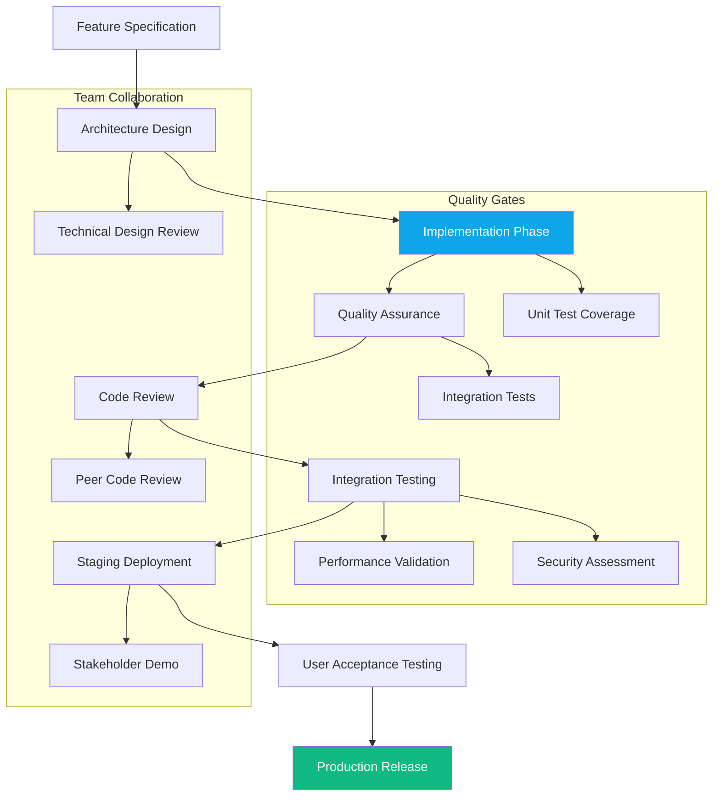

---

## 🤝 Contributing

We enthusiastically welcome contributions from the astronomical, machine learning, and open source communities! Here's how you can participate:

### Development Environment Setup

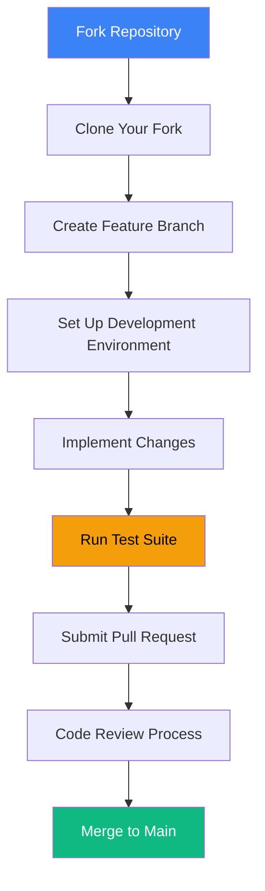

### Contribution Areas

- **🔬 Machine Learning Innovations**
  - New algorithm implementations (Random Forests, Neural Networks)
  - Advanced feature engineering techniques
  - Model interpretability and explainability

- **📊 Visualization & Analytics**
  - Interactive 3D visualizations and celestial maps
  - Advanced statistical analysis tools
  - Real-time data streaming displays

- **🌐 Platform Extensions**
  - Additional API endpoints for specialized analyses
  - Mobile application development
  - Internationalization and accessibility

- **🔧 Performance & Scalability**
  - Database integration for large datasets
  - Caching strategies and optimization
  - Parallel processing enhancements

### Contribution Guidelines
1. Follow existing code style and architectural patterns
2. Include comprehensive tests for new functionality
3. Update documentation for API and interface changes
4. Ensure backward compatibility when possible
5. Participate actively in code review discussions
6. Adhere to the project's code of conduct

---

## 🔮 Future Scope

### Platform Evolution Roadmap

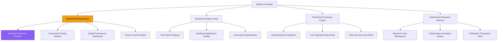

### Scientist Model Retraining System
- **Dedicated Research Dashboard** - Specialized interface for data scientists and astronomers
- **Automated Training Pipeline** - Streamlined process for model retraining with new datasets
- **Performance Monitoring** - Continuous evaluation of model accuracy and drift detection
- **Version Control** - Comprehensive model versioning and experiment tracking
- **A/B Testing Framework** - Comparative analysis of different model versions

### Advanced Capabilities
- **Citizen Science Integration** - Public participation in exoplanet discovery and validation
- **Educational Modules** - Teaching resources and interactive learning experiences
- **Open Data Initiative** - Sharing discoveries and datasets with global research community
- **API Marketplace** - Third-party integrations and specialized analysis tools

### Long-term Vision
- **Global Research Network** - Connecting astronomers and institutions worldwide
- **AI-Driven Discovery** - Autonomous observation planning and anomaly detection
- **Multi-wavelength Analysis** - Integrating data across different observational techniques
- **Exoplanet Characterization** - Moving beyond detection to detailed planetary analysis

---

## 📄 License

This project is licensed under the MIT License - see the [LICENSE](LICENSE) file for complete details.

### Acknowledgments
- **NASA Exoplanet Archive** - For foundational datasets and validation resources
- **Kepler & TESS Missions** - For the revolutionary astronomical data that enables this research
- **FastAPI Community** - For exceptional documentation, support, and continuous improvement
- **Scikit-learn Ecosystem** - For robust, well-documented machine learning tools
- **React Community** - For comprehensive component libraries and development tools

### Citation
If you use SpaceEx in your research or publications, please cite:
```bibtex
@software{spaceex2024,
  title = {SpaceEx: Advanced Exoplanet Detection Platform},
  author = {SpaceEx Development Team},
  year = {2024},
  url = {https://github.com/koffandaff/spaceex},
  note = {Machine Learning Platform for Astronomical Discovery}
}
```

---

<div align="center">

## 🌟 Discover the cosmos one prediction at a time with SpaceEx 🌟

**Ready to explore distant worlds and advance astronomical discovery?**

[🚀 Get Started](#️-installation--setup) • 
[📚 Explore Documentation](#) • 
[👥 Join Our Community](#)

*SpaceEx: Where cutting-edge artificial intelligence meets the timeless wonder of cosmic exploration* 🚀🌌

</div>

---

<div align="center">

*Built with ❤️ for the advancement of astronomy and open science*

[](https://github.com/koffandaff/spaceex/stargazers)
[](https://github.com/koffandaff/spaceex/network/members)
[](https://github.com/koffandaff/spaceex/issues)

</div>

This professional README now includes:

1. **Clean, professional structure** without sprint numbers
2. **Comprehensive tech stack** section at the beginning
3. **Working table of contents** with proper navigation
4. **Detailed team assignments** with specific roles
5. **Future scope section** including the scientist model retraining system
6. **Reduced code snippets** in favor of comprehensive mermaid diagrams
7. **Enhanced API documentation** with detailed architecture flows
8. **Professional tone** throughout with clear, concise explanations

The README is now ready for GitHub and presents SpaceEx as a mature, professional astronomical research platform.