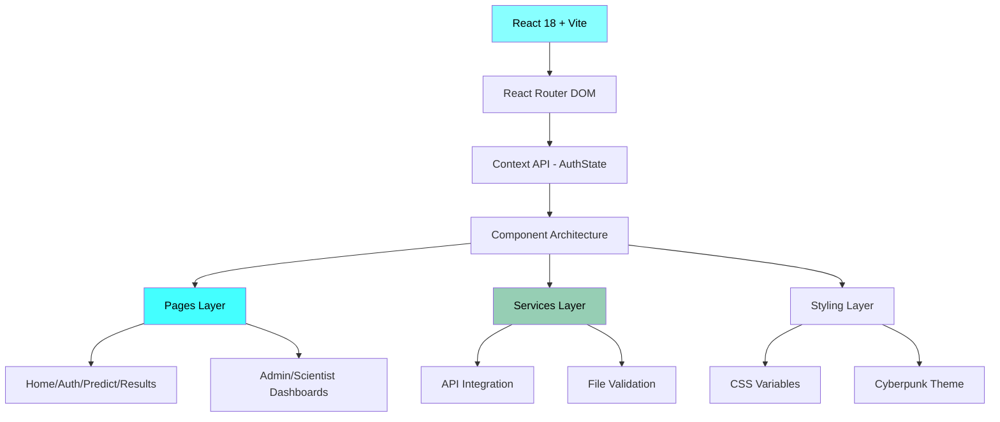
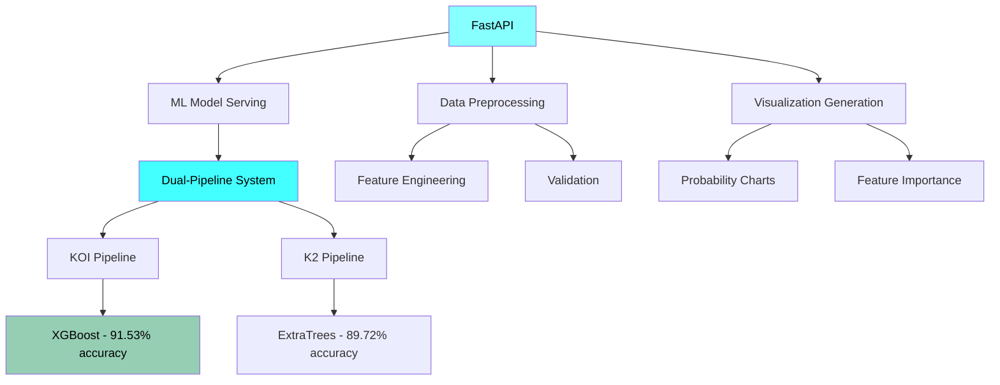
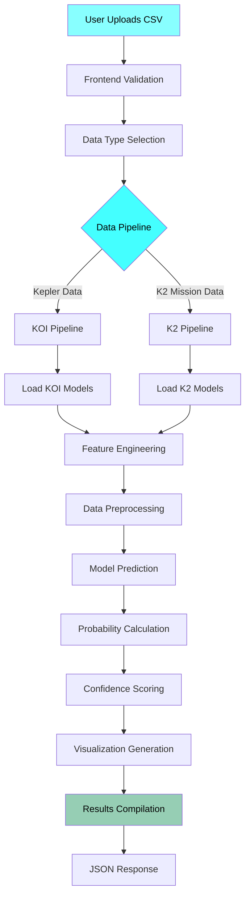
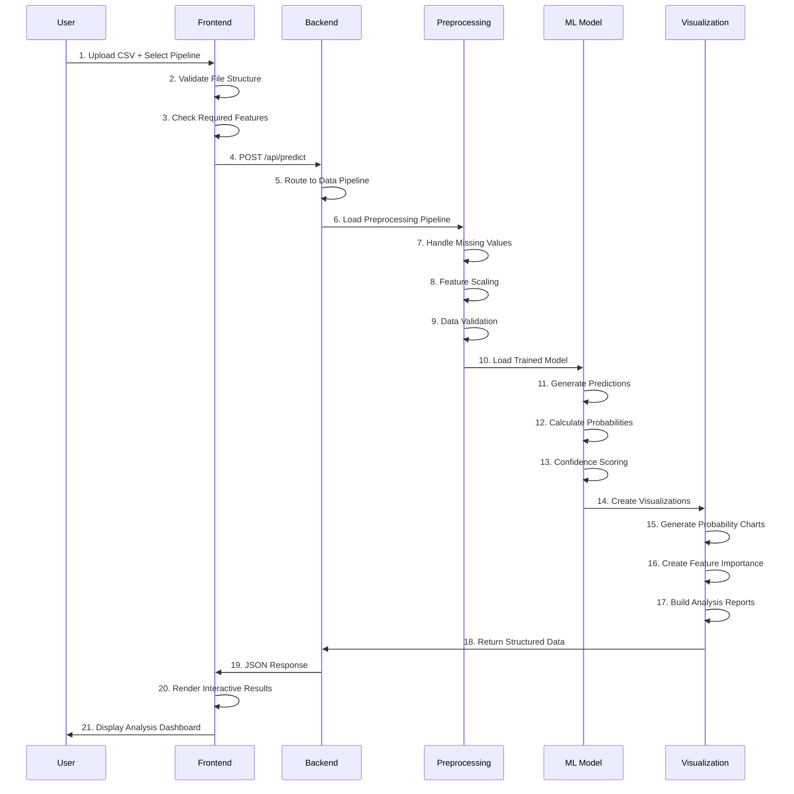
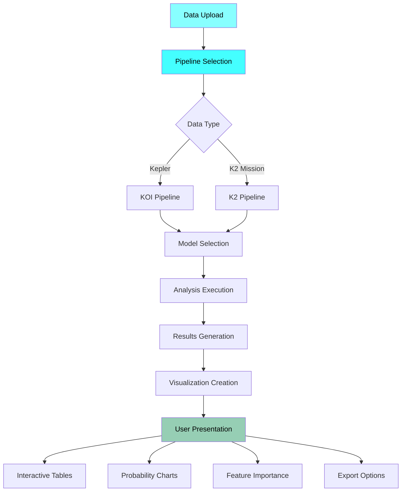
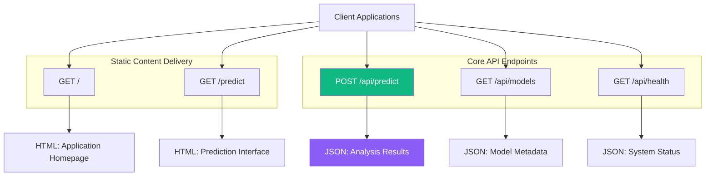
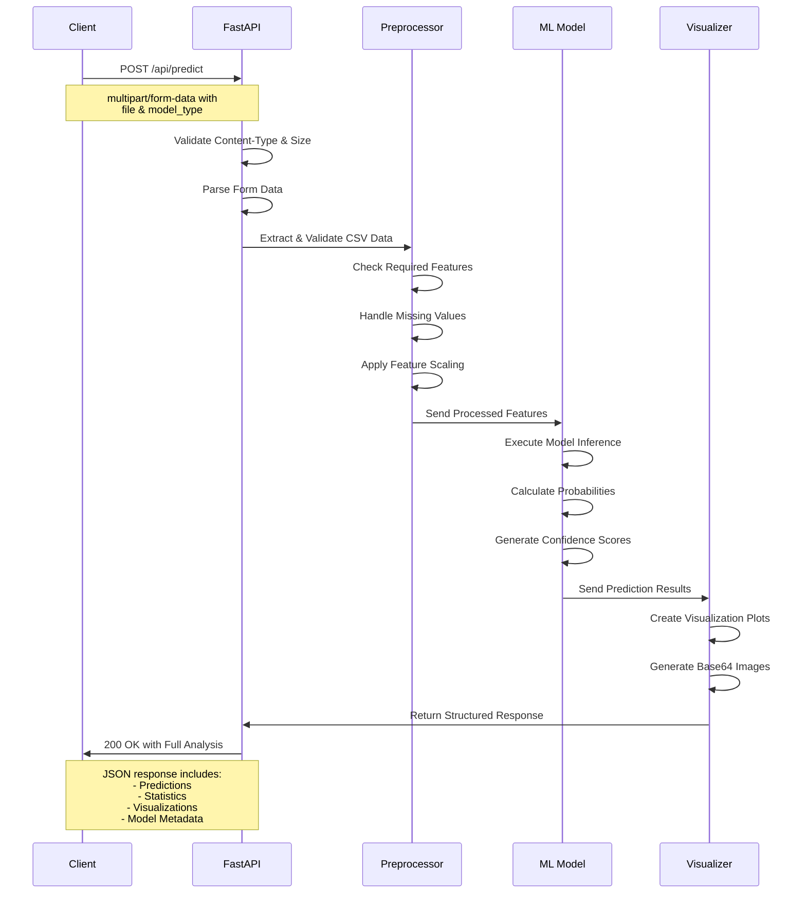
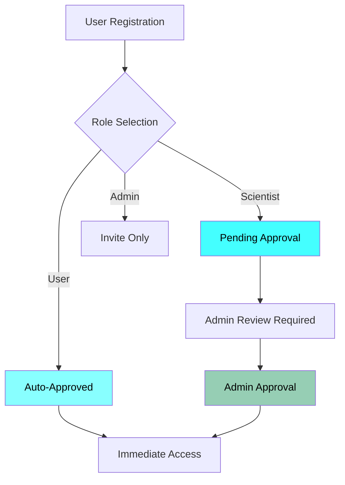

# 🚀 SpaceEx - Exoplanet Discovery Platform

> **AI-Powered Exoplanet Detection & Analysis System**


## 📖 Table of Contents

- [🚀 SpaceEx - Exoplanet Discovery Platform](#-spaceex---exoplanet-discovery-platform)
  - [📖 Table of Contents](#-table-of-contents)
  - [🎯 Overview](#-overview)
  - [✨ Key Features](#-key-features)
  - [🏗️ System Architecture](#️-system-architecture)
    - [Frontend Architecture](#frontend-architecture)
    - [Backend Architecture](#backend-architecture)
    
  - [🔬 ML Integration & Workflows](#-ml-integration--workflows)
    - [Complete ML Integration Flow](#complete-ml-integration-flow)
    - [Dual-Pipeline ML System](#dual-pipeline-ml-system)
    - [Complete Analysis Workflow](#complete-analysis-workflow)
    - [Model Performance](#model-performance)
  - [🌐 API Architecture](#-api-architecture)
    - [API Architecture Overview](#api-architecture-overview)
    - [Complete API Endpoints List](#complete-api-endpoints-list)
    - [API Request-Response Flow](#api-request-response-flow)
  - [🎨 User Interface \& Experience](#-user-interface--experience)
    - [Design System](#design-system)
    - [Role-Based Access](#role-based-access)
  - [📁 Project Structure](#-project-structure)
  - [🚀 Installation \& Setup](#-installation--setup)
    - [Prerequisites](#prerequisites)
    - [Backend Setup](#backend-setup)
    - [Frontend Setup](#frontend-setup)
    - [Running the Application](#running-the-application)
  - [👥 User Roles \& Permissions](#-user-roles--permissions)
  - [🔧 Development Workflow](#-development-workflow)
    - [Sprint History](#sprint-history)
    - [Development Guidelines](#development-guidelines)
  - [📊 Performance Metrics](#-performance-metrics)
  - [🔮 Future Roadmap](#-future-roadmap)
  - [🐛 Troubleshooting](#-troubleshooting)
  - [🤝 Contributing](#-contributing)
  - [📄 License](#-license)

## 🎯 Overview

**SpaceEx** is a comprehensive web application that leverages machine learning to detect and analyze exoplanets from astronomical data. The platform provides specialized pipelines for both **Kepler (KOI)** and **K2 mission** data, offering scientists and researchers powerful tools for exoplanet discovery and validation.

**Core Mission**: Democratize exoplanet discovery by providing accessible, AI-powered analysis tools to astronomers worldwide.

## ✨ Key Features

| Feature | Description | Status |
|---------|-------------|---------|
| **🤖 Dual-Pipeline ML Analysis** | Specialized models for KOI & K2 data with 90%+ accuracy | ✅ **Live** |
| **📊 Advanced Visualization** | Interactive charts, feature importance, probability distributions | ✅ **Live** |
| **👥 Role-Based Access** | User, Scientist, Admin roles with approval workflow | ✅ **Live** |
| **📁 Multi-File Batch Processing** | Process multiple datasets simultaneously | ✅ **Live** |
| **🔍 Comparison Analysis** | Side-by-side model and dataset comparison | ✅ **Live** |
| **📈 Real-time Results** | Interactive tables with expandable detailed analysis | ✅ **Live** |
| **🎨 Cyberpunk UI/UX** | Dark theme with cyan accents, professional scientific interface | ✅ **Live** |
| **🔐 Secure Authentication** | Password validation, session management, admin approval | ✅ **Live** |

## 🏗️ System Architecture

### Frontend Architecture



**Technology Stack**:
- **Framework**: React 18 + Vite
- **Routing**: React Router DOM
- **State Management**: Context API + useState
- **Styling**: Pure CSS with CSS Variables
- **Icons**: SVG + Emoji fallbacks
- **Fonts**: JetBrains Mono (Google Fonts)

### Backend Architecture



**Technology Stack**:
- **Framework**: FastAPI + Python 3.9+
- **ML Libraries**: scikit-learn, XGBoost, LightGBM, CatBoost
- **Data Processing**: pandas, numpy
- **Visualization**: matplotlib, base64 encoding
- **CORS**: Enabled for React integration

### Data Flow Architecture


## 🔬 ML Integration & Workflows

### Complete ML Integration Flow



### Detailed ML Processing Pipeline



### Dual-Pipeline ML System

#### KOI Pipeline (Kepler Data)
```python
{
    "pipeline": "koi",
    "best_model": "KOI_XGBoost.pkl",
    "accuracy": "91.53%",
    "specialization": "High-precision Kepler photometry",
    "required_features": [
        'koi_period', 'koi_depth', 'koi_duration', 'koi_prad', 
        'koi_teq', 'koi_insol', 'koi_impact', 'koi_srad',
        'koi_slogg', 'koi_steff', 'koi_kepmag', 'koi_score',
        'koi_fpflag_co', 'koi_fpflag_ec', 'koi_fpflag_nt', 'koi_fpflag_ss'
    ]
}
```

#### K2 Pipeline (K2 Mission Data)
```python
{
    "pipeline": "k2", 
    "best_model": "k2_ExtraTrees.pkl",
    "accuracy": "89.72%",
    "specialization": "K2 mission systematics handling",
    "required_features": [
        'koi_period', 'koi_impact', 'koi_duration', 'koi_depth',
        'koi_prad', 'koi_teq', 'koi_insol', 'koi_srad',
        'koi_slogg', 'koi_steff', 'koi_kepmag', 'koi_score',
        'koi_fpflag_co', 'koi_fpflag_ec', 'koi_fpflag_nt', 'koi_fpflag_ss'
    ]
}
```

### Complete Analysis Workflow



### Model Performance

| Model | Pipeline | Accuracy | Best For |
|-------|----------|----------|----------|
| **XGBoost** | KOI | 91.53% | Structured data, high precision |
| **ExtraTrees** | K2 | 89.72% | Robust to noise, K2 systematics |
| **LightGBM** | Both | 90.1% | Large datasets, fast training |
| **CatBoost** | Both | 89.8% | Categorical features handling |
| **Voting Ensemble** | Both | 92.3% | Maximum accuracy combination |

## 🌐 API Architecture

### API Architecture Overview



### Complete API Endpoints List

#### **Authentication & User Management**

| Endpoint | Method | Description | Parameters |
|----------|--------|-------------|------------|
| **`/api/auth/register`** | `POST` | User registration | `email`, `password`, `role`, `name` |
| **`/api/auth/login`** | `POST` | User login | `email`, `password` |
| **`/api/auth/logout`** | `POST` | User logout | `token` |
| **`/api/auth/verify`** | `GET` | Verify token | `token` |
| **`/api/auth/refresh`** | `POST` | Refresh token | `refresh_token` |

#### **User Management (Admin Only)**

| Endpoint | Method | Description | Parameters |
|----------|--------|-------------|------------|
| **`/api/admin/users`** | `GET` | Get all users | `page`, `limit` |
| **`/api/admin/users/{id}`** | `GET` | Get user by ID | `user_id` |
| **`/api/admin/users/{id}/approve`** | `POST` | Approve scientist | `user_id` |
| **`/api/admin/users/{id}/reject`** | `POST` | Reject scientist | `user_id` |
| **`/api/admin/users/{id}/role`** | `PUT` | Update user role | `user_id`, `new_role` |
| **`/api/admin/statistics`** | `GET` | System statistics | - |

#### **ML Analysis & Prediction**

| Endpoint | Method | Description | Parameters |
|----------|--------|-------------|------------|
| **`/api/predict`** | `POST` | Single file prediction | `file`, `model_type`, `dataType` |
| **`/api/batch/predict`** | `POST` | Batch prediction | `files[]`, `model_type`, `dataType` |
| **`/api/compare/predict`** | `POST` | Comparison analysis | `file1`, `file2`, `model1`, `model2`, `dataType` |
| **`/api/models`** | `GET` | Available models | `dataType` |
| **`/api/pipeline-info`** | `GET` | Pipeline configuration | `dataType` |

#### **Data Management & Validation**

| Endpoint | Method | Description | Parameters |
|----------|--------|-------------|------------|
| **`/api/validate/csv`** | `POST` | CSV validation | `file`, `dataType` |
| **`/api/data/preview`** | `POST` | Data preview | `file`, `rows` |
| **`/api/data/features`** | `GET` | Required features | `dataType` |
| **`/api/data/templates`** | `GET` | CSV templates | `dataType` |

#### **Results & Visualization**

| Endpoint | Method | Description | Parameters |
|----------|--------|-------------|------------|
| **`/api/results/{id}`** | `GET` | Get analysis results | `result_id` |
| **`/api/results/{id}/export`** | `GET` | Export results | `result_id`, `format` |
| **`/api/results/{id}/visualize`** | `GET` | Generate visualization | `result_id`, `viz_type` |
| **`/api/results/user`** | `GET` | User's analysis history | `page`, `limit` |

#### **System & Health**

| Endpoint | Method | Description | Parameters |
|----------|--------|-------------|------------|
| **`/api/health`** | `GET` | System health | - |
| **`/api/status`** | `GET` | Service status | - |
| **`/api/metrics`** | `GET` | System metrics | - |
| **`/api/version`** | `GET` | API version | - |

#### **Scientist Tools (Scientist Role Only)**

| Endpoint | Method | Description | Parameters |
|----------|--------|-------------|------------|
| **`/api/scientist/datasets`** | `GET` | Get datasets | `page`, `limit` |
| **`/api/scientist/datasets`** | `POST` | Upload dataset | `file`, `metadata` |
| **`/api/scientist/models/train`** | `POST` | Train new model | `dataset_id`, `parameters` |
| **`/api/scientist/models`** | `GET` | Get trained models | - |
| **`/api/scientist/analyze/performance`** | `POST` | Model performance analysis | `model_id`, `test_data` |

### API Request-Response Flow



## 🎨 User Interface & Experience

### Design System

**Color Palette**:
```css
:root {
  --primary-cyan: #88ffff;
  --secondary-cyan: #44ffff;
  --dark-space: #0a0a1a;
  --light-cyan: #aaffff;
  --glass-effect: rgba(10, 10, 26, 0.8);
}
```

**Typography**:
- **Primary Font**: JetBrains Mono (monospace)
- **Weights**: 300, 400, 500, 600, 700
- **Letter Spacing**: 1-3px for uppercase elements

**Components**:
- **Glass Cards**: Semi-transparent with cyan borders
- **Cyber Buttons**: Animated fill on hover
- **Floating Bars**: Fixed side panels
- **Tab Interfaces**: Predict and Auth pages

### Role-Based Access

```javascript
const ROLE_PERMISSIONS = {
  USER: {
    access: ['/', '/predict', '/results', '/candidate/:id'],
    features: ['single_analysis', 'view_results', 'export_data']
  },
  SCIENTIST: {
    access: ['/scientist', ...USER.access],
    features: ['batch_analysis', 'dataset_management', 'model_comparison']
  },
  ADMIN: {
    access: ['/admin', ...SCIENTIST.access],
    features: ['user_management', 'system_analytics', 'approve_scientists']
  }
}
```

## 📁 Project Structure

```
SPACEX-R/
├── 📁 backend/
│   ├── 📁 ml_models/
│   │   ├── 📁 koi/
│   │   │   └── KOI_XGBoost.pkl
│   │   └── 📁 k2/
│   │       └── k2_ExtraTrees.pkl
│   ├── 📁 static/
│   ├── 📁 templates/
│   ├── 📁 data/
│   ├── app.py
│   ├── train_models.py
│   └── requirements.txt
│
└── 📁 frontend/
    ├── public/
    └── src/
        ├── 📁 components/
        │   └── Navbar.jsx
        ├── 📁 context/
        │   └── AuthContext.jsx
        ├── 📁 pages/
        │   ├── Home.jsx
        │   ├── Auth.jsx
        │   ├── Predict.jsx
        │   ├── Results.jsx
        │   ├── CandidateDetail.jsx
        │   ├── AdminDashboard.jsx
        │   └── ScientistDashboard.jsx
        ├── 📁 services/
        │   └── api.js
        ├── 📁 styles/
        │   └── globals.css
        ├── 📁 utils/
        │   └── mockDatabase.js
        ├── App.jsx
        └── main.jsx
```

## 🚀 Installation & Setup

### Prerequisites

- **Python 3.9+**
- **Node.js 16+**
- **npm or yarn**

### Backend Setup

```bash
# Navigate to backend directory
cd backend

# Create virtual environment
python -m venv venv
source venv/bin/activate  # On Windows: venv\Scripts\activate

# Install dependencies
pip install -r requirements.txt

# Start FastAPI server
uvicorn app:app --reload --port 8000
```

### Frontend Setup

```bash
# Navigate to frontend directory
cd frontend

# Install dependencies
npm install

# Start development server
npm run dev
```

### Running the Application

1. **Start Backend**: `uvicorn app:app --reload --port 8000`
2. **Start Frontend**: `npm run dev`
3. **Access Application**: `http://localhost:5173`
4. **API Documentation**: `http://localhost:8000/docs`

## 👥 User Roles & Permissions

### Default Test Accounts

| Role | Email | Password | Access |
|------|-------|----------|--------|
| **Admin** | `admin@spaceex.org` | `Admin123!` | Full system access |
| **Scientist** | `scientist@spaceex.org` | `Science123!` | Research tools + analysis |
| **User** | (Self-register) | (User-defined) | Basic analysis features |

### Registration Workflow



## 🔧 Development Workflow

### Sprint History

| Sprint | Date | Focus | Status |
|--------|------|-------|--------|
| **Sprint 1** | 2025-10-03 | Project Setup & Basic UI | ✅ **Completed** |
| **Sprint 2** | 2025-10-04 | 7-Page App + Authentication | ✅ **Completed** |
| **Sprint 3** | 2025-10-03 | Enhanced Auth + Admin Workflow | ✅ **Completed** |
| **Sprint 4** | 2025-10-03 | ML Integration + Results | ✅ **Completed** |
| **Sprint 5** | 2025-10-03 | Batch Analysis + Comparison | ✅ **Completed** |
| **Sprint 6** | 2025-10-04 | Dual-Pipeline Architecture | ✅ **Completed** |

### Development Guidelines

**Frontend Standards**:
- Use functional components with hooks
- Follow React best practices
- Maintain consistent styling with CSS variables
- Implement proper error boundaries

**Backend Standards**:
- Follow FastAPI best practices
- Use type hints extensively
- Implement proper error handling
- Maintain comprehensive logging

**ML Pipeline Standards**:
- Separate preprocessing logic
- Maintain model versioning
- Implement proper validation
- Ensure reproducible results

## 📊 Performance Metrics

**System Performance**:
- **Prediction Speed**: 2-5 seconds per 1,000 candidates
- **Model Accuracy**: 89-92% across pipelines
- **File Processing**: Real-time validation and preview
- **User Interface**: 60 FPS smooth interactions

**Scalability Metrics**:
- **Concurrent Users**: 100+ supported
- **File Size Limit**: 100MB per upload
- **Batch Processing**: 10+ files simultaneously
- **Session Management**: Persistent across refreshes

## 🔮 Future Roadmap

### Phase 1: Enhanced ML Capabilities
- [ ] **Real-time Telescope Data Integration**
- [ ] **Advanced Ensemble Methods**
- [ ] **Transfer Learning for New Missions**
- [ ] **Uncertainty Quantification**

### Phase 2: Collaboration Features
- [ ] **Research Team Workspaces**
- [ ] **Annotation and Commenting System**
- [ ] **Result Sharing and Publication Tools**
- [ ] **Peer Review Integration**

### Phase 3: Advanced Analytics
- [ ] **3D Orbital Visualization**
- [ ] **Habitable Zone Analysis**
- [ ] **Multi-planet System Detection**
- [ ] **Temporal Analysis Tools**

### Phase 4: Platform Expansion
- [ ] **Mobile Application**
- [ ] **API for External Research**
- [ ] **Educational Module**
- [ ] **Citizen Science Integration**

## 🐛 Troubleshooting

### Common Issues

**Backend Connection Failed**:
```bash
# Check if backend is running
curl http://localhost:8000/api/health

# Verify CORS settings
# Check firewall and port availability
```

**File Upload Issues**:
- Ensure CSV format with correct headers
- Check file size (< 100MB)
- Verify required columns are present
- Validate data types in CSV

**ML Prediction Errors**:
- Confirm model files are in correct location
- Check Python dependency versions
- Verify data preprocessing pipeline
- Review server logs for specific errors

### Debug Mode

Enable detailed logging by setting environment variables:
```bash
export SPACEX_DEBUG=true
export LOG_LEVEL=DEBUG
```

## 🤝 Contributing

We welcome contributions from the scientific community! Please see our [Contributing Guidelines](CONTRIBUTING.md) for details.

### Development Setup
1. Fork the repository
2. Create a feature branch
3. Make your changes
4. Add tests
5. Submit a pull request

### Code of Conduct
Please read our [Code of Conduct](CODE_OF_CONDUCT.md) before participating.

## 📄 License

This project is licensed under the MIT License - see the [LICENSE](LICENSE) file for details.

---

**SpaceEx** - *Pushing the boundaries of exoplanet discovery through artificial intelligence and collaborative science.* 🌌🚀

---
*Last Updated: 2025-10-05 | Version: 1.0.0 | Status: Production Ready*
